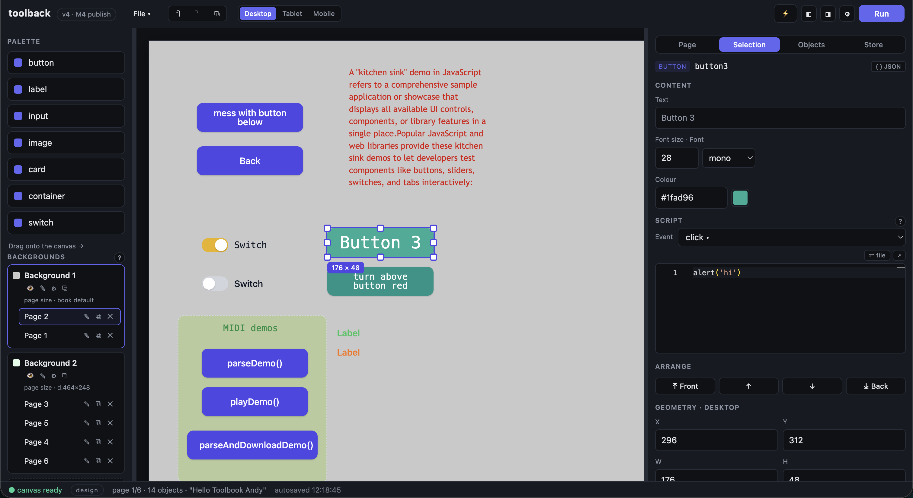

# Toolback

A modern **ToolBook** spiritual successor: *book → pages → objects*, authored
visually, scripted in **plain JavaScript**. If you ever built something in
ToolBook or HyperCard, you'll feel at home — everything else is 2026.



Books are **open data** (a single `.toolbook.json`), editing is local-first
(an autosave in IndexedDB keeps nothing hostage), and *publish* produces one
self-contained HTML file you can drop anywhere. No backend, no build step for
your books, nothing to install for your readers.

---

## Why I built this

ToolBook (and HyperCard before it) had something that the modern web lost:
**the author and the reader were the same person, five minutes apart.** Click a
button into existence, script it in a language that fit on one screen, and press
a key to play. Publishing was "save a file". A kid could make something and
*deploy it* before lunch.

Authoring tools today are a hellscape by comparison — a login, a cloud
subscription, a wall of panels, an SDK version matrix, a two-stage pipeline, a
build step that needs its own conference talk, and a platform that decides to
deprecate your "simple" app every six months. Nothing you make is yours, and
nothing stays small.

toolback is the counter-move, driven by nostalgia *and* intent:

- **Easy to use again** — drag-and-drop authoring, a visible canvas, one screen
  of sensible panels. Design and run share one space; F3 / ⌥3 flips between
  them like the ToolBook of old.
- **Easy to deploy again** — **Publish** writes a single standalone `.html`
  with everything (player, your book, even npm libraries) baked in. Host it on
  any static server, stick it in a `public/` folder, email the file. There is
  no "backend" and no "production environment".
- **Modern under the hood** — scripts are **plain JavaScript**: no dialect, no
  macro language, no 1990s scripting school. The editor's IntelliSense is
  curated to exactly what your book can use, and books run in a sandboxed
  canvas that keeps even the most broken script from taking the editor down.
- **Open and yours** — books are JSON, which means they're git-diffable,
  grep-able, and portable. There's no locked format and no cloud lock-in.

ToolBook heritage is everywhere in the model (the `self` / `target` /
`forward()` event chain, backgrounds as shared page resources, popups, F3 run
toggle) — but the words you type are JavaScript.

## What you can do

- **Author visually** — drag controls (button, label, input, image, card,
  container, switch, group) onto a canvas with a 8px grid; resize, arrange,
  group/ungroup, duplicate; per-breakpoint layouts for desktop / tablet /
  mobile.
- **Script in plain JS** — object event scripts, page scripts, background
  scripts, and full IntelliSense (Ctrl+Space) that only offers things that
  actually exist in your book. Red squiggles catch syntax errors before you
  press Run.
- **The ToolBook event model** — an explicit owner chain, not DOM bubbling:
  the innermost handler runs and stops unless you call `forward()`.
  `self` = the object whose script you're writing, `target` = what was clicked.
- **A store that's data, not code** — keep design values in the Book tab, seed
  every run from them, and watch live `store.set()s` while a run is going.
  `{{key}}` labels resolve right in the design view.
- **Pages, navigation & popups** — `page.go('Results')`, `page.enter`
  lifecycle, and any page opening any other as a floating dialog.
- **Backgrounds** — the classic shared-page trick: one background's objects
  appear on every page that uses it, a perfect home for a nav bar.
- **Author-mode plugins** — a page flagged *Plugin page* can run as a floating
  tool *while you author*, driving the editor through a small `author`
  bridge. Everything a plugin does is ordinary undoable book history.
- **npm libraries in books** — `await import('@tonejs/midi')` just works
  (esm.sh at runtime, or pre-bundled onto a local "library shelf" for fully
  offline publishes). The kitchen-sink example builds a two-note MIDI in-browser.
- **Undo/redo, duplicate, Copy JSON** — whole-book snapshot history, duplicate
  cascades, and `{ } JSON` on the selection for inspecting structures.
- **Publish** — one click → a single self-contained `.html` standing alone.

See the full [scripting guide](docs/scripting-guide.md) — everything a script
can do, with copy-paste recipes. For how it works under the hood (architecture,
the editor↔canvas message protocol, the file-link sync engine):
[runtime-internals.md](docs/runtime-internals.md).

## Debugging

Debugging feels like the web, because it *is* the web:

- **Status bar errors** — script failures appear in the editor's status bar,
  tagged with where they came from (`button1.click: Error: …`,
  `page script: SyntaxError: …`), with a ✕ to dismiss.
- **Browser devtools (F12)** — open devtools and pick the **canvas frame**'s
  context; any `console.log(...)` in your scripts lands there. Your scripts run
  in a sandboxed iframe, so they can't take the editor down — but you can still
  inspect them for real.
- **Live Store tab** — during a run, the Store tab is a live stream: every
  `store.set()` shows up as it happens, and each row's ⇓ copies the live value
  into the design store for the next run. A live-coding loop.
- **Edit scripts in VS Code** — every script editor has a **⇄ file** button:
  link the script to a real `.js` file on disk and edit it in VS Code (or
  anything). The sync is two-way and carefully race-proofed — type in the
  editor, save in VS Code, either way the book and the file stay in step.
  ⤢ pops the editor out into a resizable floating window.

## Project layout

A pnpm monorepo — dependencies run `format ← controls ← runtime ← editor`.

```
apps/editor/      the editor app — Vue 3 + Pinia + Monaco
packages/
  format/         @toolback/format      — book/page/object zod schemas + factories
  controls/       @toolback/controls    — plain-DOM control renderers, zero framework
  runtime/        @toolback/runtime     — the player: no Vue. Renders JSON,
                                          runs scripts, editor↔canvas protocol
  libs/           @toolback/libs        — the "library shelf" for npm-in-books
examples/         ready-made .toolbook.json books + a test that runs every page
docs/             scripting-guide.md (author-facing) + runtime-internals.md
doco/             screenshots
```

The editor is the single source of truth for the book; the canvas runs the same
runtime used for publishing, inside a sandboxed same-origin iframe — so design
mode and run mode share one thing, and broken user scripts can never crash the
editor.

## Getting started

Requires [pnpm](https://pnpm.io) (enable it with `corepack enable` if you don't
have it). Node 20+.

```sh
pnpm install      # install workspace deps
pnpm dev          # editor dev server → http://localhost:5173
pnpm test         # vitest across packages, apps and example books
pnpm typecheck    # tsc / vue-tsc across the monorepo
pnpm build        # production build
```

Hungry for a quick tour? Open an example book with **File → Open…** and press
**Run** (F3 or ⌥3):

- `examples/hello-counter.toolbook.json` — the classic first book
- `examples/quiz.toolbook.json` — navigation + a score in the shared store
- `examples/kitchen-sink.toolbook.json` — an 8-page guided tour of every feature
- `examples/author-plugin.toolbook.json` — an author-mode plugin driving the editor

(More detail on each in [examples/README.md](examples/README.md).)

## Deploying the editor

The editor is a fully client-side app — deploy it to any static host, including
**Netlify**, `gh-pages`, or a plain `nginx` folder:

- **Build**: `pnpm install && pnpm build`
- **Publish**: `apps/editor/dist`

A `netlify.toml` and a `pnpm-lock.yaml` are included, so a Netlify deploy with
*Base directory:* `/` and *Build command:* `pnpm install && pnpm build` works
out of the box. Because everything is local-first, an exported book
(`.toolbook.json` *or* a published `.html`) runs from any static host without a
server of any kind.

> The File System Access API used by **Open…**, **Save** and **⇄ file** linking
> requires a secure context (HTTPS) and a Chromium browser — on Netlify's
> HTTPS that's just how it works. Non-supporting browsers fall back to classic
> file dialogs for open/save.

## Status & history

M0–M6c (core authoring, scripting, pages/popups/backgrounds, groups, store,
npm-in-books, author plugins) are complete. The full plan, architecture and
milestone log live in [PLAN.md](PLAN.md); the npm-library design write-up is in
[PLAN-NPM-SUPPORT.md](PLAN-NPM-SUPPORT.md).